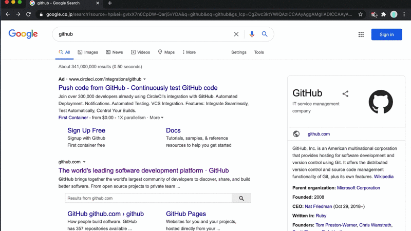

# Google Date Range Search Extension

Chrome extension to use custom date range in Google Search.

## features

- searches in a preset date range
  - past hour/day/week/month/year
- searches in a custom date range
  - past _n_ hour(s)/day(s)/week(s)/month(s)/year(s)
- searches in an arbitrary range
  - specify arbitrary range using calendar
