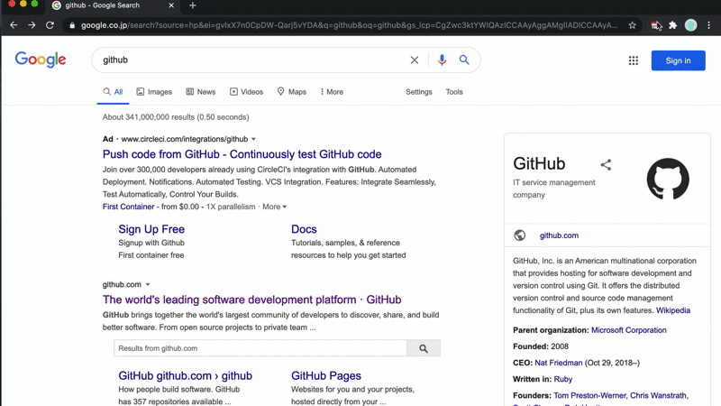
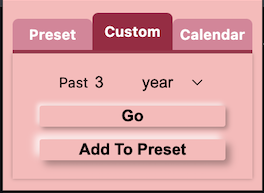
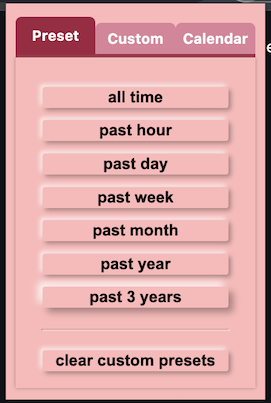

# Google Date Range Search Extension

A browser extension that helps you search Google search results within specific date ranges.
It provides preset date ranges, custom ranges, and a calendar interface for precise date selection.

## features

- Searches in a preset date range
  - past hour/day/week/month/year
  - You can create custom preset buttons for frequently used date ranges
- Searches in a custom date range
  - past _n_ hour(s)/day(s)/week(s)/month(s)/year(s)
- Searches in any date range
  - select any start and end date using a calendar interface

### Create custom preset buttons

1. Click the "Custom" tab
2. Enter a number and select a unit (hours/days/weeks/months/years)
3. Click "Add to presets"
4. The custom preset button will appear in the "Preset" tab
5. You can add multiple custom presets
6. To remove all custom presets, click "clear custom presets" button at the bottom of the "Preset" tab

  
  

